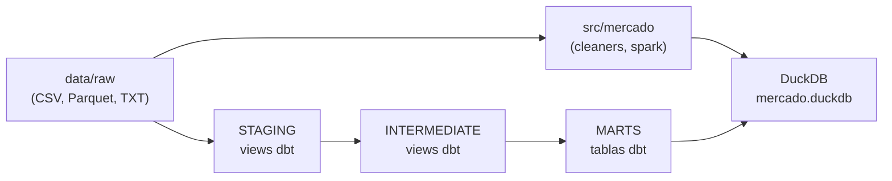

# Mercado Analytics — Prueba Técnica Analytics Engineer

## Resumen

Este proyecto construye una capa analítica end-to-end para el e-commerce **Mercado**, sobre el stack Python / SQL / PySpark / dbt-duckdb provisto por Radius. La arquitectura sigue el patrón **medallion** (RAW → STAGING → INTERMEDIATE → MARTS), con reglas de negocio parametrizadas vía variables dbt y seeds, utilidades Python puras para limpieza/normalización, y validación automatizada con pytest, ruff, sqlfluff y CI en GitHub Actions.

## Arquitectura



| Capa | Responsabilidad |
|------|-----------------|
| **RAW** | Datasets originales sin transformar; montados en `data/raw/` (solo lectura en contenedor). |
| **STAGING** | Vistas dbt que estandarizan fuentes (`stg_*__*`), tipado y renombrado; sin lógica de negocio pesada. |
| **INTERMEDIATE** | Vistas dbt con reglas de negocio compartidas (`int_*__*`), deduplicación canónica, joins preparatorios. |
| **MARTS** | Tablas dbt orientadas a consumo (`fct_*`, `dim_*`, `mart_*`) listas para análisis y reporting. |

## Stack

| Tecnología | Versión | Responsabilidad |
|------------|---------|-----------------|
| Python | 3.11 | Runtime, scripts, tests |
| pandas | 2.2.2 | Manipulación tabular, EDA |
| numpy | 1.26.4 | Operaciones numéricas |
| PySpark | 3.5.1 | Procesamiento del dataset grande de órdenes |
| DuckDB | 1.0.0 | Data warehouse local |
| dbt-core | 1.8.4 | Orquestación de modelos SQL |
| dbt-duckdb | 1.8.1 | Adaptador dbt → DuckDB |
| Jupyter Lab | 4.2.3 | Notebooks de exploración |
| matplotlib / seaborn / plotly | 3.9 / 0.13 / 5.22 | Visualizaciones EDA |
| pytest | 8.3.3 | Tests unitarios (TDD en utilities) |
| pytest-cov | 5.0.0 | Cobertura de código |
| ruff | 0.6.9 | Lint y formato Python |
| sqlfluff | 3.2.4 | Lint SQL (dialecto DuckDB + templater dbt) |
| pre-commit | 3.8.0 | Hooks de calidad pre-commit |

## Estructura del proyecto

```
.
├── data/
│   ├── raw/                 # Datasets originales (evaluación)
│   └── warehouse/           # DuckDB generado (gitignored)
├── dbt_project/mercado/     # Proyecto dbt "mercado"
├── src/mercado/             # Paquete Python (cleaners, normalizers, spark)
├── tests/                   # Tests pytest
├── notebooks/               # EDA Jupyter
├── scripts/                 # Scripts auxiliares
├── .github/workflows/       # CI GitHub Actions
├── Dockerfile               # Imagen Radius + dev deps
└── docker-compose.yml       # Entorno de desarrollo
```

## Setup y ejecución

Para la configuración inicial del entorno Docker (requisitos, datasets, primer arranque), consulta **[README_entorno.md](README_entorno.md)**.

Comandos adicionales de esta capa:

| Comando | Descripción |
|---------|-------------|
| `make build` | Construir imagen Docker |
| `make up` | Levantar Jupyter Lab |
| `make shell` | Terminal bash dentro del contenedor |
| `make test` | pytest con cobertura dentro del contenedor |
| `make lint` | ruff + sqlfluff |
| `make format` | ruff format en `src/` y `tests/` |
| `make dbt-deps` | `dbt deps` (packages.yml) |
| `make dbt-build` | `dbt build` (modelos + tests) |
| `make dbt-docs` | Generar y servir documentación dbt |

## Reglas de negocio implementadas

| # | Regla | Parametrización | Modelo / artefacto |
|---|-------|-----------------|-------------------|
| 1 | Validez de orden | `plazo_devolucion_dias`, `estados_pago_validos` | _pendiente_ |
| 2 | Canal de venta válido | `seed_canal_catalogo.csv` | _pendiente_ |
| 3 | Razón de devolución | `seed_devolucion_patrones.csv` | _pendiente_ |
| 4 | Cliente activo | `ventana_cliente_activo_meses`, `fecha_ejecucion_pipeline` | _pendiente_ |
| 5 | Segmentación por valor | `seed_umbrales_segmentacion.csv` | _pendiente_ |
| 6 | Registro canónico de orden | macro `get_orden_canonica` | _pendiente_ |
| 7 | Cliente recurrente | `umbral_recompra_dias`, `min_ordenes_cliente_recurrente` | _pendiente_ |

## Decisiones de diseño

### Por qué medallion architecture

_Placeholder: separación clara de responsabilidades por capa, trazabilidad de linaje y materialización diferenciada (views vs tables)._

### Por qué seeds en lugar de vars para catálogos extensibles

_Placeholder: catálogos versionables en CSV, editables sin tocar YAML y con tests dbt sobre filas concretas._

### Por qué TDD solo en utilities Python

_Placeholder: funciones puras son deterministas y baratas de probar; modelos dbt se validan con contratos schema.yml + tests genéricos._

### Por qué NO se aplicaron GoF patterns (YAGNI justificado)

_Placeholder: dominio acotado con 7 reglas conocidas; seeds + macros + funciones cubren el alcance sin sobre-abstracción._

### Por qué se extendió el Dockerfile de Radius (dev tooling)

_Placeholder: runtime de evaluación intacto en requirements.txt; dev deps aisladas en requirements-dev.txt para CI y calidad local._

## Escenarios de cambio soportados

| Escenario (PDF) | Estado |
|-----------------|--------|
| Cambiar plazo de devolución | Parametrizado vía `plazo_devolucion_dias` — implementación en modelos: _pendiente_ |
| Agregar canal de venta | Seed `seed_canal_catalogo.csv` — _pendiente_ |
| Nuevos patrones de devolución | Seed `seed_devolucion_patrones.csv` — _pendiente_ |
| Ajustar ventana cliente activo | Var `ventana_cliente_activo_meses` — _pendiente_ |
| Cambiar umbrales de segmentación | Seed `seed_umbrales_segmentacion.csv` — _pendiente_ |
| Resolver duplicados de órdenes | Macro `get_orden_canonica` — _pendiente_ |
| Definir cliente recurrente | Vars `umbral_recompra_dias`, `min_ordenes_cliente_recurrente` — _pendiente_ |

## Testing

- **Python:** pytest con TDD para utilities puras en `src/mercado/`. Cobertura mínima configurada al **70%** (`pyproject.toml`).
- **dbt:** tests genéricos (`unique`, `not_null`, `accepted_values`, `relationships`) y tests singulares para reglas de negocio, definidos en `schema.yml` antes del SQL (contract-first).

## CI/CD

El workflow [`.github/workflows/ci.yml`](.github/workflows/ci.yml) se ejecuta en cada **push** y **pull request** a `main`:

1. **python-quality:** ruff check, ruff format --check, pytest con cobertura.
2. **dbt-validation:** `dbt deps`, `dbt parse`, `dbt compile` contra DuckDB local.

## Limitaciones y siguientes pasos

_Placeholder: completar modelos dbt, seeds, macros, utilities Python, notebooks EDA y poblar la tabla de reglas de negocio._

## Créditos

Entorno de desarrollo proporcionado por **Radius** (Dockerfile base, `profiles.yml`, `sources.yml`, notebook de verificación). Implementación de la capa analítica por **Elmer Alpuche**.
